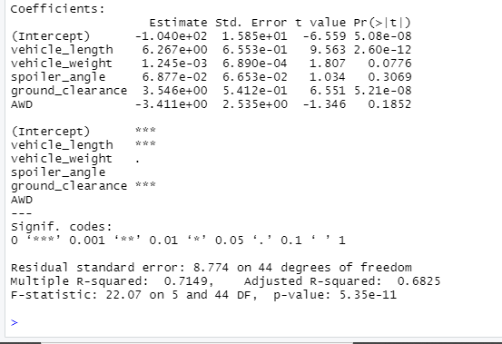
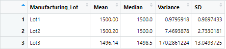
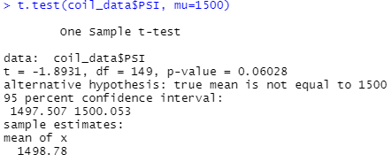
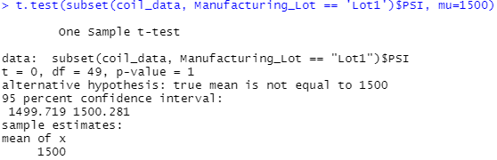
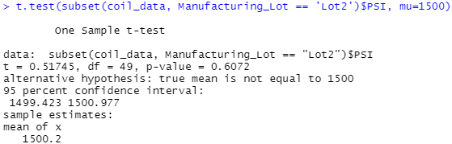
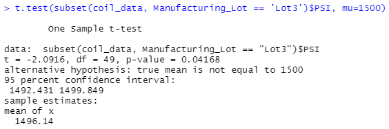

# MechaCar_Statistical_Analysis
## Linear Regression to Predict MPG
> Linear Regression Summary

    - The variables which provided a non-random amount of variance to the mpg values in the dataset, indicated by p-values lower than 0.05, are the vehicle length with a p-value of 2.60e-12 and the ground clearance with a p-value of 5.21e-08.

    - The slope is not zero. Since the p-value of our analysis is below the assumed significance level of 0.05 at 5.35e-11, there is sufficient evidence to reject null hypothesis.

    - While the model is not entirely statistically insignificant with r-values indicating an approximate 70% accuracy rate, the intercept of 5.08e-08 does point to the likelihood of additional variables and stronger analysis being ideal and I would not recommend the model as an effective predictor of mpg. 
    
## Summary Statistics on Suspension Coils

    - Below are the results from 3 lots, testing suspension coils.  

    - The total summary of all 3 lots shows variance within the specified limits of less than 100 PSI. 

    - Summaries of each lot individually reveal that while lots 1 and 2 both meet requirements, lot 3 is showing a variance of 170 PSI which is above the threshold designated by the design specifications. 

## T-Tests on Suspension Coils

    - T-Tests conducted on the suspension coil data reveal an overall p-value of 0.06028 which is above the significance level of 0.05%.  

    - The T-Test results for Lot 1 show a p-value of 1 meaning the null hypothesis is rejected and the mean for the lot equals the mean for the population. 

    - The T-Test for Lot 2 showed a p-value of 0.6072, above the significance threshold.  

    - The T-Test for Lot 3 showed a p-value of 0.04168 which is below the 0.05 threshold, rejecting the null hypothesis and indicating a difference in the means of the lot and the population.

## Study Design: MechaCar vs Competition   